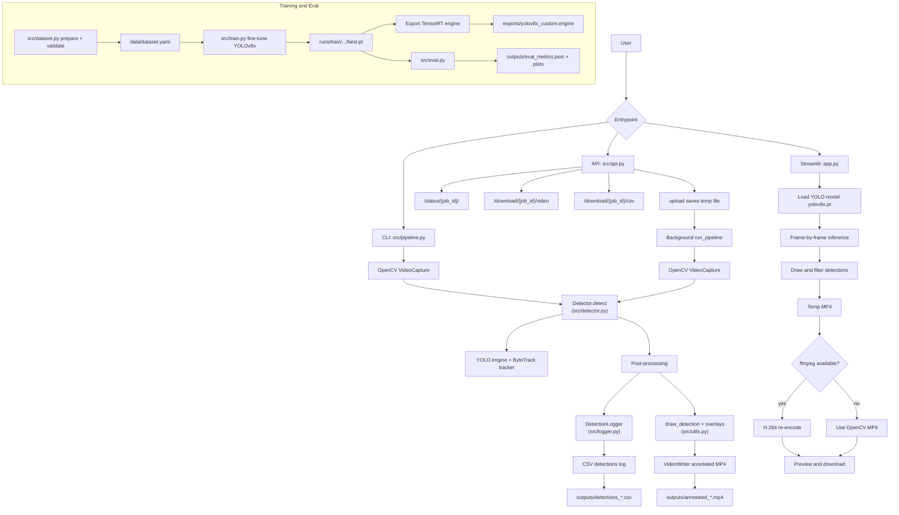

# Object Detector

Detects objects in video files using a fine-tuned YOLOv8x model.
Outputs an annotated video with bounding boxes + a CSV of all detections.

Runs fully locally — no cloud APIs, no paid services.

---

## Requirements
- Python 3.10
- NVIDIA GPU (RTX 4090 recommended)
- CUDA 12.1 + cuDNN 8.9
- 24GB+ VRAM for training (16GB minimum for inference)

## Setup
```bash
git clone https://github.com/yourname/object-detector
cd object-detector
python3.10 -m venv venv
source venv/bin/activate
python -m pip install --upgrade pip
pip install -r requirements.txt
```

On Windows (PowerShell), activate with:
```powershell
venv\Scripts\Activate.ps1
```

For CUDA 12.1 builds of PyTorch:
```bash
pip install torch==2.3.0+cu121 torchvision==0.18.0+cu121 --index-url https://download.pytorch.org/whl/cu121
```

## Usage

### Run on a video file
```bash
python src/pipeline.py --input path/to/video.mp4
```

### Run API service
```bash
uvicorn src.api:app --host 0.0.0.0 --port 8000
# API docs: http://localhost:8000/docs
```

### Run Streamlit app
```bash
streamlit run app.py
```

### Using Shell Script
```bash
./run.sh
```

### Train the model
```bash
python src/train.py
```

### Evaluate model performance
```bash
python src/eval.py
```

## Output
- `outputs/annotated_<filename>.mp4` — video with bounding boxes drawn
- `outputs/detections_<filename>.csv` — frame-by-frame detection log

## Architecture


## Project Structure
```
object-detector/
├── src/                ← Python source code
│   ├── dataset.py      ← Dataset preparation and validation
│   ├── train.py        ← Model training and TensorRT export
│   ├── eval.py         ← Model evaluation
│   ├── detector.py     ← TensorRT inference engine
│   ├── pipeline.py     ← Video processing pipeline
│   ├── logger.py       ← CSV detection logging
│   ├── utils.py        ← Drawing utilities
│   ├── scaler.py       ← Resolution scaling
│   └── api.py          ← FastAPI web server
├── app.py              ← Streamlit app
├── data/               ← Dataset (not committed to Git)
├── exports/            ← TensorRT engine files (not committed)
├── outputs/            ← Generated videos and CSVs (not committed)
└── docs/               ← Documentation and reference material
```

## Classes detected
person, chair, laptop, mouse, keyboard, monitor, mobile phone, bottle, cup,
book, backpack, handbag, umbrella, dog, cat, bird, bicycle, car, motorbike,
dining table, couch, potted plant, bed
